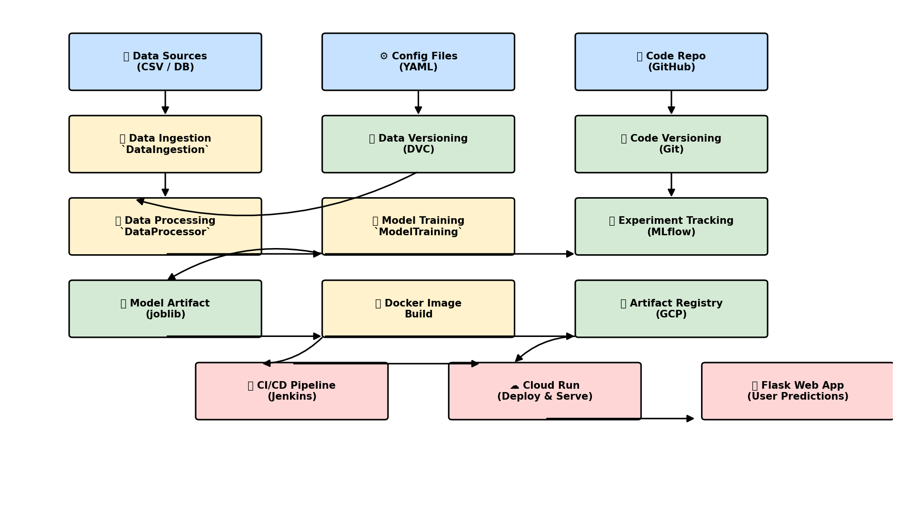
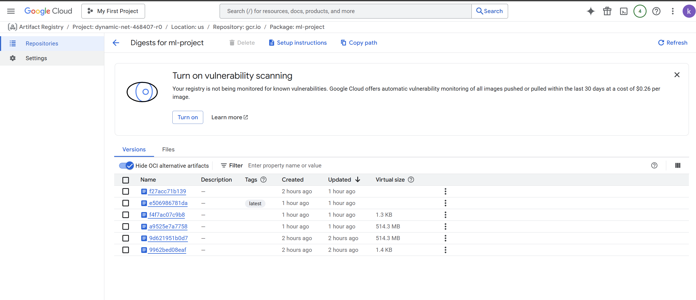

# Hotel Reservation Prediction - MLOps Project

[](https://ml-project-942938206338.us-central1.run.app/)
[](https://www.python.org/)
[](https://www.docker.com/)
[](https://www.jenkins.io/)

## 🧭 Architecture



## 📌 Project Overview
This project predicts whether a hotel reservation will be honored or canceled using Machine Learning. 
It follows an end-to-end MLOps workflow, integrating model development, containerization, CI/CD, and deployment on Google Cloud Platform (GCP).


The goal is to build a predictive system that can forecast hotel reservation cancellations, enabling hotel management to optimize booking processes and reduce revenue loss.

---

## 🛠 Tech Stack
- **Programming Language:** Python
- **Machine Learning:** Scikit-learn, Pandas, NumPy
- **Experiment Tracking:** MLflow
- **Version Control:** Git & GitHub
- **Data Versioning:** DVC
- **Containerization:** Docker
- **CI/CD:** Jenkins
- **Deployment Platform:** Google Cloud Platform (Cloud Run, Artifact Registry)
- **Web Framework:** Flask

---

## 📊 Workflow
Based on the provided [NOTES & WORKFLOW](NOTES%20%26%20WORKFLOW.pdf)【9†source】:
1. **Database Setup**
2. **Project Setup**
3. **Data Ingestion**
4. **Data Processing & Feature Engineering**
5. **Model Training**
6. **Experiment Tracking (MLflow)**
7. **Data & Code Versioning (DVC + Git)**
8. **User Application Building (Flask Web App)**
9. **Containerization (Docker)**
10. **CI/CD Pipeline Setup (Jenkins)**
11. **Deployment to Google Cloud Run**

---

## 📂 Dataset
- **Source:** Provided in the project description
- **Features:** Lead time, number of special requests, average price per room, arrival date/month, market segment type, number of nights, meal plan type, room type, etc.
- **Target Variable:** Whether the reservation will be canceled or not.

---

## 🚀 Features
- End-to-end MLOps pipeline implementation
- Automated model training and deployment
- Real-time prediction web application with Flask【28†source】
- Scalable deployment using GCP Cloud Run
- Integrated CI/CD with Jenkins

---

## ⚙️ Setup Instructions

### 🔹 Local Setup
```bash
# Clone the repository
git clone https://github.com/kiwa-debug/MLOps-Hotel-Reservation-Prediction.git
cd MLOps-Hotel-Reservation-Prediction

# Create virtual environment
python -m venv venv
source venv/bin/activate  # For Windows: venv\Scripts\activate

# Install dependencies
pip install -r requirements.txt

# Run training pipeline
python training_pipeline.py

# Run the Flask app
python application.py
```

### 🔹 Installation via setup.py
```bash
pip install .
```

---

## 🐳 Run with Docker
```bash
# Build Docker image
docker build -t hotel-reservation-prediction .

# Run container
docker run -p 8080:8080 hotel-reservation-prediction
```

---

## 🔄 CI/CD Pipeline (Jenkins)
1. **Code Commit:** Push changes to GitHub
2. **Build:** Jenkins fetches code, builds Docker image
3. **Test:** Runs automated tests
4. **Push Image:** Docker image pushed to GCP Artifact Registry
5. **Deploy:** Updated container deployed to GCP Cloud Run

---

## 📦 Training Pipeline
Defined in [`training_pipeline.py`](training_pipeline.py)【31†source】:
1. Data ingestion
2. Data preprocessing
3. Model training
4. Model storage (`joblib` format)

---

## 📜 Common Utility Functions
From [`common_functions.py`](common_functions.py)【30†source】:
- `read_yaml(path)` → Reads configuration YAML files
- `load_data(path)` → Loads CSV datasets into Pandas DataFrame

---

## 🌐 Live Demo
👉 **[Click Here to Try the App](https://ml-project-942938206338.us-central1.run.app/)**

---

## 📸 Screenshots
### GCP Artifact Registry


### Prediction Page


---

## 📜 License
This project is licensed under the MIT License.
